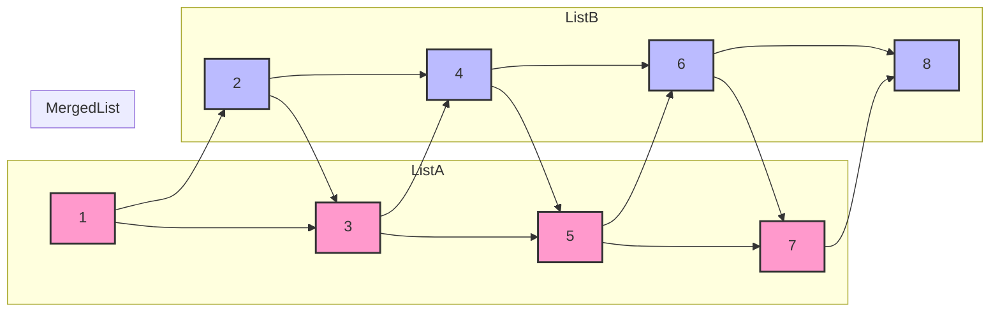
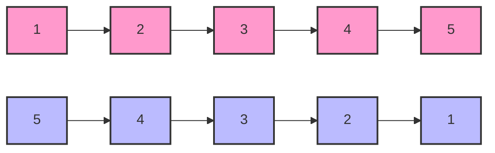

---
tags:
  - DataStructure
Date: 2024-10-12
Title: Linked List
References:
---


---

## Data Structures Overview

Data structures help in storing and organizing data efficiently. Linked lists are one such data structure that allows dynamic memory allocation and provides flexibility in terms of size and structure.

### Introduction to Linked Lists

A Linked List is a collection of elements called nodes, where each node has two components:
1. **Data**: Stores the actual data.
2. **Pointer**: A reference to the next node in the list.

**Key Properties:**
- The first node is called the **Head**.
- The last node is called the **Tail**, and its pointer is `null`.
- Linked Lists do not use contiguous memory locations.

**Types of Linked Lists:**
- **Singly Linked List**: Each node contains a pointer to the next node.
- **Doubly Linked List**: Each node contains two pointers, one to the next node and one to the previous node.
- **Circular Linked List**: The last node points back to the head.
- **Circular Doubly Linked List**: A combination of both circular and doubly linked lists.

---

## Linked List Implementation in Java

### Node Class
```java
class Node {
    int data;
    Node next;
    Node(int data) {
        this.data = data;
        this.next = null;
    }
}
```

### Traversing a Linked List

To traverse a linked list, we follow the chain of pointers starting from the head until we reach a node with a null pointer (the tail).

```java
public static void printList(Node headNode) {
    Node temp = headNode;
    while (temp != null) {
        System.out.print(temp.data + " ");
        temp = temp.next;
    }
}
```

### Diagram - Singly Linked List


---

### Inserting Nodes

**Case 1: Insert at the Beginning**
```java
public static Node insertAtStart(Node head, int data) {
    Node newNode = new Node(data);
    newNode.next = head;
    head = newNode;
    return head;
}
```

**Case 2: Insert at the End**
```java
public static Node insertAtEnd(Node head, int data) {
    Node newNode = new Node(data);
    if (head == null) {
        head = newNode;
        return head;
    }
    Node temp = head;
    while (temp.next != null) {
        temp = temp.next;
    }
    temp.next = newNode;
    return head;
}
```

**Case 3: Insert at a Specific Index**
```java
public static Node insertAtIndex(Node head, int index, int data) {
    if (index == 1) return insertAtStart(head, data);
    Node temp = head;
    int i = 1;
    while (i < index - 1 && temp != null) {
        temp = temp.next;
        i++;
    }
    if (temp == null) {
        System.out.println("Index out of bound");
        return head;
    }
    Node newNode = new Node(data);
    newNode.next = temp.next;
    temp.next = newNode;
    return head;
}
```

---

## Deleting Nodes

**Deleting the First Node**
```java
public static Node deleteFirstNode(Node head) {
    if (head == null) return null;
    return head.next;
}
```

**Deleting the Last Node**
```java
public static Node deleteLastNode(Node head) {
    if (head == null || head.next == null) return null;
    Node temp = head;
    while (temp.next.next != null) {
        temp = temp.next;
    }
    temp.next = null;
    return head;
}
```

**Deleting a Node in the Middle**
```java
public static Node deleteNodeAtIndex(Node head, int index) {
    if (index == 1) return deleteFirstNode(head);
    Node temp = head;
    int i = 1;
    while (i < index - 1 && temp != null) {
        temp = temp.next;
        i++;
    }
    if (temp == null || temp.next == null) {
        System.out.println("Index out of bound");
        return head;
    }
    temp.next = temp.next.next;
    return head;
}
```

---

## Midpoint of a Linked List

**Optimal One-Pass Solution**
Using two pointers: a slow pointer (moves one step at a time) and a fast pointer (moves two steps at a time).

```java
public static Node returnMiddle(Node head) {
    if (head == null || head.next == null) return head;
    Node slow = head;
    Node fast = head.next;
    while (fast != null && fast.next != null) {
        fast = fast.next.next;
        slow = slow.next;
    }
    return slow;
}
```

---

## Merging Two Sorted Linked Lists

```java
public static Node mergeTwoLists(Node l1, Node l2) {
    if (l1 == null) return l2;
    if (l2 == null) return l1;
    if (l1.data < l2.data) {
        l1.next = mergeTwoLists(l1.next, l2);
        return l1;
    } else {
        l2.next = mergeTwoLists(l1, l2.next);
        return l2;
    }
}
```

### Diagram - Merge Two Sorted Linked Lists



---

## Reversing a Linked List

**Recursive Approach (Optimal)**
```java
public static Node reverseLinkedList(Node head) {
    if (head == null || head.next == null) return head;
    Node reversedList = reverseLinkedList(head.next);
    head.next.next = head;
    head.next = null;
    return reversedList;
}
```

### Iterative Approach
```java
public static Node reverse(Node head) {
    Node prev = null;
    Node curr = head;
    Node next;
    while (curr != null) {
        next = curr.next;
        curr.next = prev;
        prev = curr;
        curr = next;
    }
    return prev;
}
```

### Diagram - Reverse a Linked List



---

