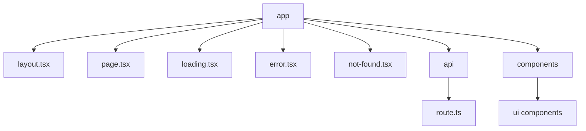
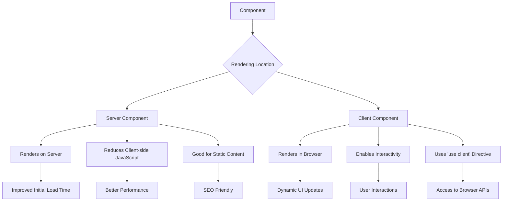

---
tags:
  - NextJs
Date: 2024-10-12
Title: Introduction and Setup
References:
---

# Chapter 1: Introduction to Next.js

## What is Next.js?

Next.js is a React framework for building production-grade web applications. It enhances React's capabilities with server-side rendering, static site generation, and other powerful features, making it easier to build fast, SEO-friendly, and scalable web applications.

## Key Features of Next.js (Latest Version)

1. **App Router**: A new routing system that supports layouts, nested routing, and more.
2. **React Server Components**: Allows rendering React components on the server for improved performance.
3. **Server-Side Rendering (SSR)**: Renders pages on the server, improving initial load time and SEO.
4. **Static Site Generation (SSG)**: Generates static HTML at build time for even faster page loads.
5. **API Routes**: Allows you to build API endpoints as part of your Next.js app.
6. **Built-in CSS Support**: Supports CSS Modules, Sass, and other styling options out of the box.
7. **Code Splitting**: Automatically splits your code to load only what's necessary for each page.
8. **Image Optimization**: Provides automatic image optimization with the next/image component.
9. **Fast Refresh**: Gives instantaneous feedback on edits made to your React components.

## Why Use Next.js?

### 1. Improved Performance
- Server Components reduce the amount of JavaScript sent to the client
- Automatic code splitting for faster page loads

### 2. Better SEO
- Server-side rendering ensures that search engines can crawl your content effectively
- Improved load times can positively impact search rankings

### 3. Developer Experience
- Intuitive file-based routing system with the new App Router
- Built-in support for TypeScript
- Hot module replacement for faster development

### 4. Scalability
- Can handle applications of any size, from small websites to large, complex web applications
- Supports both static and dynamic content

### 5. Flexibility
- Works with your preferred data fetching methods
- Supports various styling options (CSS Modules, Sass, styled-components, etc.)

## Server Components vs. Client Components

### Server Components
- Render on the server
- Reduce the amount of JavaScript sent to the client
- Great for static or infrequently updated content

### Client Components
- Render on the client (browser)
- Enable interactive features
- Use the 'use client' directive at the top of the file

## Next.js App Router vs. Pages Router

| Feature | App Router | Pages Router |
|---------|------------|--------------|
| Routing | Based on file system in `app` directory | Based on file system in `pages` directory |
| Layouts | Nested layouts with `layout.js` | Manual layout implementation |
| Loading UI | Built-in with `loading.js` | Manual implementation |
| Server Components | Default | Not available |
| Data Fetching | New patterns with `fetch` and React `use` | `getServerSideProps`, `getStaticProps` |
| Streaming | Supported out of the box | Not available |

## Getting Started

To create a new Next.js project with the App Router, use the following command:

```bash
npx create-next-app@latest my-next-app
```

When prompted, choose to use the App Router.

## Examples and Illustrations

### 1. Basic Next.js Page Structure (App Router)

Here's an example of a simple Next.js page using the App Router:

```tsx
// app/page.tsx
import { Metadata } from 'next'

export const metadata: Metadata = {
  title: 'Welcome to Next.js',
  description: 'This is a basic Next.js page using the App Router.',
}

export default function HomePage() {
  return (
    <div className="p-4">
      <h1 className="text-2xl font-bold mb-4">Welcome to Next.js!</h1>
      <p>This is a basic Next.js page using the App Router.</p>
    </div>
  )
}
```

### 2. Server Component Example

Here's how you can implement a Server Component in Next.js:

```tsx
// app/server-component.tsx
import { Metadata } from 'next'

export const metadata: Metadata = {
  title: 'Server Component Example',
  description: 'This is a server component in Next.js',
}

async function getData() {
  const res = await fetch('https://api.example.com/data')
  return res.json()
}

export default async function ServerComponent() {
  const data = await getData()

  return (
    <div>
      <h1>Server Component</h1>
      <pre>{JSON.stringify(data, null, 2)}</pre>
    </div>
  )
}
```

### 3. Client Component Example

Here's how you can implement a Client Component in Next.js:

```tsx
// app/client-component.tsx
'use client'

import { useState } from 'react'

export default function ClientComponent() {
  const [count, setCount] = useState(0)

  return (
    <div>
      <h1>Client Component</h1>
      <p>Count: {count}</p>
      <button onClick={() => setCount(count + 1)}>Increment</button>
    </div>
  )
}
```

### 4. Next.js App Router Structure Diagram

The following diagram illustrates the basic structure of a Next.js app using the App Router:



### 5. Server Components vs Client Components

Here's a visual comparison of Server Components and Client Components:



### 6. Interactive Next.js Component Example (Client Component)

Here's an example of an interactive counter component in Next.js:

```

This interactive counter component demonstrates how you can create client-side interactivity in a Next.js application using the App Router. It uses React hooks and can be easily integrated into any Next.js page.

## Conclusion

Next.js, with its latest App Router and Server Components, provides a powerful framework for building modern web applications. Its focus on performance, SEO, and developer experience makes it an excellent choice for projects of all sizes. As you continue your journey with Next.js, you'll discover how these features can significantly enhance your development workflow and the quality of your applications.
