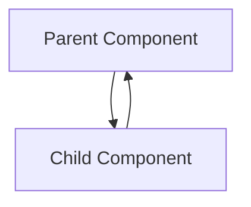

---
tags:
  - ReactJs
Date: 2024-10-20
Title: Introduction
References:
---
### Chapter 2: Understanding ReactJS Fundamentals and Its Major Features

#### Prerequisites to ReactJS
- **Basic knowledge of JavaScript**: Understanding ES6 features like arrow functions, classes, and modules.
- **HTML and CSS knowledge**: Familiarity with creating web pages and styling them.

#### Introduce ReactJS and JSX
ReactJS is a JavaScript library for building user interfaces, especially for single-page applications. JSX (JavaScript XML) allows us to write HTML-like syntax in our JavaScript code, making it easier to create React components.

**Example: Simple JSX Syntax**
```javascript
const element = <h1>Hello, world!</h1>;
```

#### Building Views with Elements and Components
- **Elements**: The smallest building block of React apps. A React element is an object representing a DOM node.
- **Components**: Reusable pieces of code that return React elements. They can be functional or class-based.

**Example: Functional Component**
```javascript
function Greeting() {
    return <h1>Welcome to React!</h1>;
}
```

#### Controlling the Component Data Using Props and State
- **Props**: Short for properties, used to pass data from parent to child components.
- **State**: Local data maintained by a component, which can change over time.

**Example: Using Props and State**
```javascript
function Greeting(props) {
    return <h1>Hello, {props.name}!</h1>;
}

// Using state in a functional component
import React, { useState } from 'react';

function Counter() {
    const [count, setCount] = useState(0);

    return (
        <div>
            <p>You clicked {count} times</p>
            <button onClick={() => setCount(count + 1)}>Click me</button>
        </div>
    );
}
```

#### Knowing the Importance of Key Prop
The `key` prop helps React identify which items have changed, are added, or are removed. It should be a unique and stable identifier for each item in a list.

**Example: Using Key Prop**
```javascript
const items = ['Apple', 'Banana', 'Cherry'];
const listItems = items.map((item, index) => <li key={index}>{item}</li>);
```

#### Learning Event Handling
Handling events in React is similar to handling events in plain JavaScript, but with some differences, such as using camelCase for event names.

**Example: Handling Click Event**
```javascript
function Button() {
    const handleClick = () => {
        alert('Button clicked!');
    };

    return <button onClick={handleClick}>Click me</button>;
}
```

#### Understanding Virtual DOM
The Virtual DOM is a lightweight representation of the real DOM. React updates the Virtual DOM and then efficiently updates the real DOM, improving performance.

#### Difference Between Unidirectional Data Flow and Bidirectional Data Flow
- **Unidirectional Data Flow**: Data flows in one direction—from parent to child. This makes the data flow easier to understand and debug.
- **Bidirectional Data Flow**: Data can flow in both directions, which can lead to complex interactions.

**Diagram: Data Flow in React**


#### Accessing DOM Elements in React
To access DOM elements directly, use the `ref` attribute.

**Example: Using Ref to Access DOM Node**
```javascript
import React, { useRef } from 'react';

function TextInputWithFocusButton() {
    const inputRef = useRef(null);

    const focusInput = () => {
        inputRef.current.focus();
    };

    return (
        <div>
            <input ref={inputRef} type="text" />
            <button onClick={focusInput}>Focus the input</button>
        </div>
    );
}
```

#### Describing How to Manage State Globally Using [[Context API]]
The Context API allows for global state management, enabling you to share values between components without explicitly passing props through every level of the tree.

**Example: Creating a Context**
```javascript
import React, { createContext, useContext, useState } from 'react';

const MyContext = createContext();

function MyProvider({ children }) {
    const [value, setValue] = useState('Hello, Context!');
    return (
        <MyContext.Provider value={{ value, setValue }}>
            {children}
        </MyContext.Provider>
    );
}

// Using context in a child component
function ChildComponent() {
    const { value } = useContext(MyContext);
    return <div>{value}</div>;
}
```

#### Understanding [[Server Side Rendering]] Technique
Server-side rendering (SSR) allows React to render components on the server, improving performance and SEO. Frameworks like Next.js support SSR out of the box.

---

Feel free to add, modify, or request any specific examples or diagrams for this chapter!