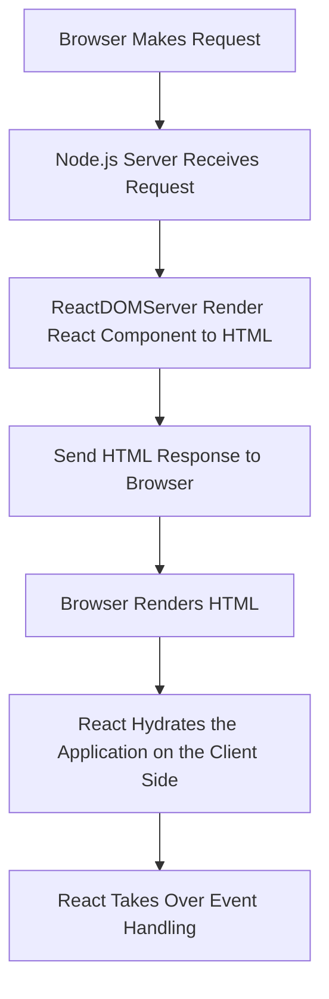

---
tags:
  - ReactJs
Date: 2024-10-16
Title: Server Side Rendering
References:
---
Here are comprehensive notes on **React Server-Side Rendering (SSR)**, based on the FreeCodeCamp article:

---

### React Server-Side Rendering (SSR)

#### What is Server-Side Rendering (SSR)?
Server-Side Rendering (SSR) is the process of rendering the initial HTML content of a React application on the server before sending it to the client. Instead of the browser fetching JavaScript, running it, and rendering the UI on the client side (Client-Side Rendering, CSR), SSR generates fully-rendered HTML on the server and serves it to the browser.

**Key Benefits of SSR**:
1. **Improved SEO**: Since search engine crawlers have access to the fully rendered HTML content, it allows better indexing and visibility.
2. **Faster First Page Load**: Users get fully rendered HTML right from the server, providing them with faster initial page loads and better perceived performance.
3. **Optimized Performance on Low-powered Devices**: By offloading the initial rendering work to the server, devices with low processing power can load pages more quickly.

#### Three Simple Steps for Server-Side Rendering with React

##### Step 1: Setting Up a Node.js Server
In SSR, a server is required to generate the HTML on the server-side and handle requests. One of the most commonly used environments is Node.js because of its seamless integration with JavaScript-based applications like React.

**Code Example**:
```javascript
const express = require('express');
const app = express();
const PORT = 3000;

app.listen(PORT, () => {
    console.log(`Server is running on port ${PORT}`);
});
```

In this example, we're setting up a basic **Express** server to handle requests and responses.

##### Step 2: Rendering React Components to HTML on the Server
In React, you use `ReactDOMServer` to render components on the server side. `ReactDOMServer` provides a function `renderToString` which converts your React component into an HTML string. This HTML can then be sent to the client as a response from the server.

**Code Example**:
```javascript
const React = require('react');
const ReactDOMServer = require('react-dom/server');

const App = require('./App'); // Import the root component of your React app

app.get('*', (req, res) => {
    const appHTML = ReactDOMServer.renderToString(<App />);
    res.send(`
        <!DOCTYPE html>
        <html>
            <head>
                <title>React SSR</title>
            </head>
            <body>
                <div id="root">${appHTML}</div>
                <script src="/bundle.js"></script>
            </body>
        </html>
    `);
});
```

- **`renderToString(<App />)`**: This renders the `App` component as a string of HTML.
- The rendered HTML is inserted into the `<div id="root"></div>` placeholder, where it will be hydrated later.

##### Step 3: Hydrating the Client-Side with React
Once the server sends the pre-rendered HTML to the client, React takes over on the client side through a process called **hydration**. During hydration, React attaches event listeners and initializes the JavaScript logic without re-rendering the entire page.

The `ReactDOM.hydrate` function is used on the client side to efficiently bind React components to the already rendered HTML.

**Code Example** (Client Side):
```javascript
import React from 'react';
import ReactDOM from 'react-dom';
import App from './App';

// Hydrate the already rendered HTML with React on the client side
ReactDOM.hydrate(<App />, document.getElementById('root'));
```

This ensures that React continues to manage and interact with the DOM, even though the initial HTML was rendered on the server.

---

### React Server-Side Rendering Flow

Here’s a basic flowchart of how SSR works:



1. The browser makes a request to the server.
2. The server uses `ReactDOMServer` to render the React components into an HTML string.
3. The server sends the fully rendered HTML page to the browser.
4. The browser displays the HTML content.
5. React hydrates the static HTML on the client side, attaching event listeners and managing further interactions.

---

### When to Use SSR?

- **SEO-Dependent Pages**: If SEO is critical to your application (e.g., blogs, e-commerce platforms), SSR provides a significant boost by serving fully rendered HTML that search engine bots can easily crawl.
- **Faster Initial Loads**: When users need to quickly access content without waiting for large JavaScript bundles to load and execute, SSR helps by delivering HTML right away.
- **Content-Heavy Pages**: Pages with a lot of static content or catalog data (e.g., landing pages or product listings) benefit from SSR due to improved load times and better SEO.

---

### Drawbacks of SSR

- **Performance Overhead on the Server**: Rendering on the server can be CPU-intensive, especially for complex pages. The server must handle the rendering process for each request, which can slow down the server under high traffic.
- **Increased Complexity**: Implementing SSR adds more complexity to the development setup. You need to ensure that your React code works on both the server and client.
- **Limited Client-Side Interactivity**: While SSR renders the HTML on the server, it must still hydrate on the client, which can sometimes lead to delays in attaching event listeners and making the page interactive.

---

### Alternative Approaches: CSR vs. SSR vs. Static Site Generation (SSG)

| Approach         | Description                                                   | Pros                                      | Cons                                                |
|------------------|---------------------------------------------------------------|-------------------------------------------|-----------------------------------------------------|
| **CSR (Client-Side Rendering)**  | Renders content entirely on the client-side using JavaScript.        | Easier to implement, works well for apps. | Slower initial load, not SEO-friendly.              |
| **SSR (Server-Side Rendering)**  | Renders content on the server and sends pre-rendered HTML to the client. | Faster first load, SEO-friendly.          | Adds complexity, server load increases with traffic.|
| **SSG (Static Site Generation)** | Pre-generates HTML at build time, serving static files.                | Fastest page loads, minimal server load.  | Not suited for dynamic content that changes frequently. |

---

### Tools to Simplify React SSR
- **Next.js**: A React framework that makes SSR and static site generation easy out of the box.
- **Razzle**: A framework to build server-rendered React applications without configuration.
  
**Next.js Example**:
```bash
npx create-next-app my-next-app
cd my-next-app
npm run dev
```
Next.js provides automatic server-side rendering with minimal configuration.

---

### Conclusion
Server-Side Rendering (SSR) with React allows for faster first loads and improved SEO, making it a great solution for content-heavy and SEO-sensitive applications. However, SSR also comes with trade-offs, such as increased server complexity and performance overhead. Tools like Next.js provide a simplified way to implement SSR while maintaining the benefits.

--- 

Feel free to expand or ask for more details on specific sections if needed!