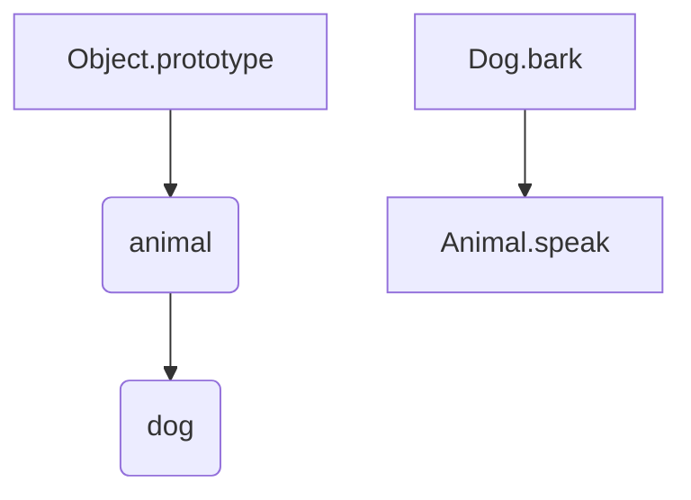

---
tags:
  - Programming
  - Javascript
Date: 2024-10-12
Title: Dummy Title
References:
---
### JavaScript Prototypes

In JavaScript, every object has a prototype. A **prototype** is also an object, and it acts as a blueprint or a "parent" from which the current object can inherit properties and methods. This is the core concept behind **prototypal inheritance**, which allows objects to share functionality without the need for traditional classes (as in other languages like Java or C++).

### Key Concepts:

1. **Prototype Chain**
   - When you try to access a property or method on an object, JavaScript first looks at that object. If the property or method isn't found, it then looks at the object's prototype. If it still isn't found, the prototype of the prototype is searched, and so on, until the top of the chain is reached. This chain of prototypes is known as the **prototype chain**.
   - At the top of this chain is `Object.prototype`, which is the base prototype for all objects. If a property or method can't be found on an object's prototype chain, `undefined` is returned.

2. **`__proto__` vs. `prototype`**
   - **`__proto__`**: This is the actual prototype of an object instance. It’s a reference to the prototype of the object from which it was created.
   - **`prototype`**: This is a property available only on functions (constructors). It defines what the prototype of objects created by this constructor will be.

---

### Example of a Prototype Chain:

```javascript
const animal = {
    speak() {
        console.log("Animal speaks");
    }
};

const dog = Object.create(animal);  // `dog` inherits from `animal`
dog.bark = function() {
    console.log("Woof!");
};

dog.bark();    // Output: "Woof!"
dog.speak();   // Output: "Animal speaks" (inherited from `animal`)
```

In this example:
- `dog` has its own `bark()` method.
- When `dog.speak()` is called, JavaScript doesn’t find `speak` on `dog`, so it checks `dog`'s prototype (`animal`), and calls `animal.speak()`.

### Visualizing the Prototype Chain



1. **Object.prototype**: All objects have `Object.prototype` at the top of their prototype chain, which contains methods like `toString()`, `hasOwnProperty()`, etc.
2. **animal**: An object containing a `speak` method.
3. **dog**: Inherits from `animal` and contains its own method `bark`.

---

### Constructor Functions and Prototypes

Constructor functions allow us to create objects and define shared methods on their prototypes:

```javascript
function Person(name) {
    this.name = name;
}

Person.prototype.greet = function() {
    console.log(`Hello, my name is ${this.name}`);
};

const alice = new Person("Alice");
const bob = new Person("Bob");

alice.greet();  // Output: Hello, my name is Alice
bob.greet();    // Output: Hello, my name is Bob
```

Here:
- `Person` is a constructor function.
- The `greet()` method is added to `Person.prototype`, meaning all instances (e.g., `alice` and `bob`) can share this method without duplicating it for each object.

### Prototype Properties and Methods

1. **Shared Methods**
   - When a method is defined on the prototype, all instances of that object share the same method. This is memory-efficient as the method is not duplicated for every object instance.
   
2. **`hasOwnProperty()`**
   - This method checks if a property exists directly on an object, not on its prototype.
   
   ```javascript
   console.log(alice.hasOwnProperty("name"));  // true (property exists on alice)
   console.log(alice.hasOwnProperty("greet")); // false (greet is in Person.prototype)
   ```

### Modifying Prototypes

You can add methods to an object’s prototype even after the object has been created.

```javascript
Person.prototype.sayGoodbye = function() {
    console.log(`${this.name} says goodbye!`);
};

alice.sayGoodbye();  // Output: Alice says goodbye!
bob.sayGoodbye();    // Output: Bob says goodbye!
```

---

### Prototype Inheritance Example:

Let's say we have an `Animal` constructor function and we want to create a specific type of animal, like a `Dog`.

```javascript
function Animal(name) {
    this.name = name;
}

Animal.prototype.speak = function() {
    console.log(`${this.name} makes a noise.`);
};

function Dog(name) {
    Animal.call(this, name);  // Call `Animal` constructor to inherit properties
}

Dog.prototype = Object.create(Animal.prototype);  // Inherit from `Animal.prototype`
Dog.prototype.constructor = Dog;  // Correct the constructor pointer

Dog.prototype.speak = function() {
    console.log(`${this.name} barks.`);
};

const dog = new Dog("Buddy");
dog.speak();  // Output: Buddy barks.
```

In this example:
- We call `Animal.call(this, name)` to inherit the properties from `Animal`.
- We set `Dog.prototype = Object.create(Animal.prototype)` to inherit methods from `Animal.prototype`.
- We then override the `speak` method for `Dog` while still retaining the ability to call `Animal` methods.

---

### Summary

- **Prototype**: Every object in JavaScript has a prototype, which is another object from which it can inherit properties and methods.
- **Prototype Chain**: If a property or method isn’t found on an object, JavaScript will search up the prototype chain until it finds the property or reaches the end of the chain.
- **Prototypal Inheritance**: Objects can inherit from other objects, allowing them to reuse properties and methods defined on the prototype.

Prototypes are fundamental to understanding JavaScript's object-oriented behavior.