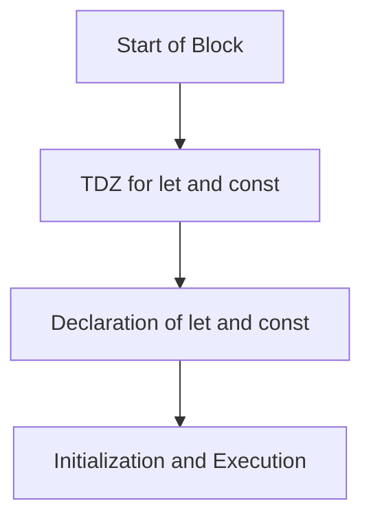

---
tags:
  - Programming
  - Javascript
Date: 2024-10-13
Title: Temporal Dead Zone
References:
---
The **Temporal Dead Zone (TDZ)** refers to the period between the entering of a block of code (such as a function or block `{ }`) and the actual declaration of variables using `let` or `const`. During this time, the variable exists but cannot be accessed, and any attempt to do so results in a **ReferenceError**.

### Key Points:
1. **Definition**:  
   The Temporal Dead Zone is the time between when a variable is hoisted (declared in memory) and when it is initialized with a value in the code.

2. **Applies to `let` and `const`**:  
   Variables declared with `let` and `const` are hoisted like `var`, but they are not initialized until the code execution reaches their declaration. This leads to the TDZ, during which these variables cannot be accessed.

3. **ReferenceError**:  
   If you try to access a `let` or `const` variable before its declaration within its scope, a **ReferenceError** will be thrown because the variable is in the TDZ.

4. **Contrast with `var`**:  
   In contrast, `var` declarations are also hoisted, but they are initialized with the value `undefined` during hoisting, allowing access to the variable before its declaration without causing an error. This behavior is why `var` doesn't have a TDZ.

### Example of Temporal Dead Zone:

```javascript
console.log(myVar);  // Output: undefined (due to hoisting)
console.log(myLet);  // Throws ReferenceError: Cannot access 'myLet' before initialization
console.log(myConst);  // Throws ReferenceError: Cannot access 'myConst' before initialization

var myVar = "This is var";
let myLet = "This is let";
const myConst = "This is const";
```

### TDZ in Action:
1. **Variable Hoisting**:  
   All variables are hoisted to the top of their scope (function or block).
   
2. **TDZ for `let` and `const`**:  
   Even though `myLet` and `myConst` are hoisted, they are not initialized until their respective lines of code are executed. Therefore, they are in the TDZ and cannot be used before this point.

3. **`var` vs TDZ**:  
   `var myVar` is hoisted and initialized with `undefined` during hoisting, so no error occurs when accessing `myVar` before its declaration.

### Visualization of TDZ:



- **Before Declaration** (TDZ): The variable is in memory but not accessible.
- **After Declaration**: The variable is initialized and can be used.