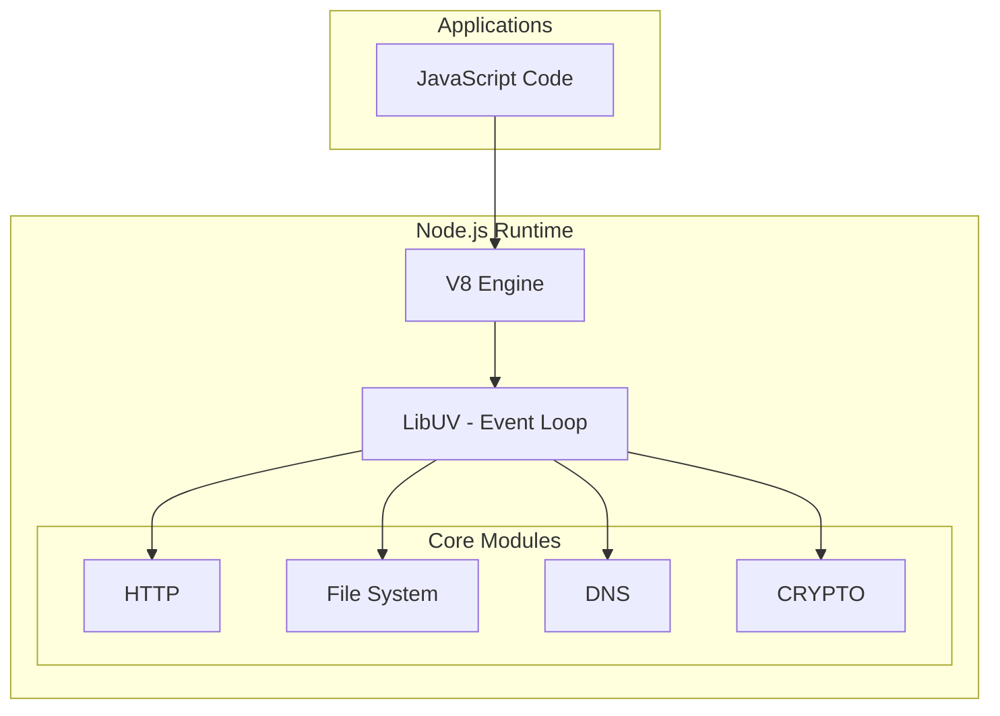
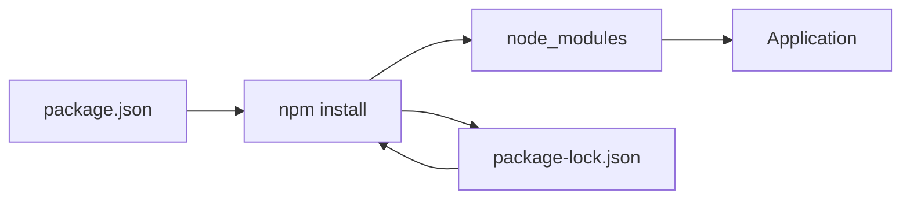

I'll help you create comprehensive notes for Node.js, starting with Chapter 2 since you're already comfortable with JavaScript.


# Node.js Comprehensive Notes

## Chapter 2: Node.js Basics

### 2.1 Node.js Architecture

Node.js is built on Chrome's V8 JavaScript engine and follows an event-driven, non-blocking I/O model.




#### Key Components:
- **V8 Engine**: Executes JavaScript code
- **LibUV**: Handles asynchronous operations
- **Event Loop**: Manages concurrent operations
- **Thread Pool**: Handles CPU-intensive tasks

### 2.2 Node.js REPL

REPL stands for Read-Eval-Print-Loop. It's an interactive programming environment.

```javascript
// Start REPL by typing 'node' in terminal
$ node

// Basic operations
> 2 + 2
4
> let name = "Node.js"
undefined
> name
'Node.js'

// Multi-line expressions
> function greet(name) {
... return `Hello, ${name}!`
... }
undefined
> greet("Developer")
'Hello, Developer!'
```

### 2.3 Global Objects

Node.js provides several global objects that are available throughout your application:

```javascript
// __dirname - current directory
console.log(__dirname);  // /Users/username/project

// __filename - current file
console.log(__filename); // /Users/username/project/app.js

// process - info about current Node.js process
console.log(process.version);     // v16.x.x
console.log(process.platform);    // darwin/win32
console.log(process.env);         // environment variables

// Buffer - for handling binary data
const buf = Buffer.from('Hello');
console.log(buf);                 // <Buffer 48 65 6c 6c 6f>

// setImmediate vs setTimeout
setImmediate(() => console.log('immediate'));
setTimeout(() => console.log('timeout'), 0);
```

### 2.4 Modules System

Node.js uses a modular system to organize code. Here's how different module systems work:

#### CommonJS (Traditional)

```javascript
// math.js
function add(a, b) {
    return a + b;
}

function subtract(a, b) {
    return a - b;
}

module.exports = {
    add,
    subtract
};

// main.js
const math = require('./math');
console.log(math.add(5, 3));      // 8
console.log(math.subtract(5, 3));  // 2
```

#### ES Modules (Modern)

```javascript
// math.mjs
export function add(a, b) {
    return a + b;
}

export function subtract(a, b) {
    return a - b;
}

// main.mjs
import { add, subtract } from './math.mjs';
console.log(add(5, 3));      // 8
console.log(subtract(5, 3));  // 2
```

### 2.5 Built-in Modules

#### File System (fs)

```javascript
const fs = require('fs');

// Synchronous read
const content = fs.readFileSync('file.txt', 'utf8');
console.log(content);

// Asynchronous read
fs.readFile('file.txt', 'utf8', (err, data) => {
    if (err) throw err;
    console.log(data);
});

// Promise-based (modern)
const { promises: fsPromises } = require('fs');

async function readFile() {
    try {
        const data = await fsPromises.readFile('file.txt', 'utf8');
        console.log(data);
    } catch (err) {
        console.error(err);
    }
}
```

#### Path Module

```javascript
const path = require('path');

// Path manipulation
console.log(path.join('/user', 'docs', 'file.txt'));  // /user/docs/file.txt
console.log(path.resolve('file.txt'));                // /absolute/path/to/file.txt
console.log(path.extname('file.txt'));                // .txt

// Parse path
const pathInfo = path.parse('/user/docs/file.txt');
console.log(pathInfo);
/*
{
    root: '/',
    dir: '/user/docs',
    base: 'file.txt',
    ext: '.txt',
    name: 'file'
}
*/
```

#### HTTP Module

```javascript
const http = require('http');

// Create basic server
const server = http.createServer((req, res) => {
    res.writeHead(200, { 'Content-Type': 'text/plain' });
    res.end('Hello World\n');
});

server.listen(3000, () => {
    console.log('Server running at http://localhost:3000/');
});

// Make HTTP request
http.get('http://api.example.com/data', (res) => {
    let data = '';
    
    res.on('data', (chunk) => {
        data += chunk;
    });
    
    res.on('end', () => {
        console.log(JSON.parse(data));
    });
}).on('error', (err) => {
    console.error(err);
});
```

### 2.6 npm (Node Package Manager)

#### Package.json Anatomy

```json
{
    "name": "my-project",
    "version": "1.0.0",
    "description": "A sample Node.js project",
    "main": "index.js",
    "scripts": {
        "start": "node index.js",
        "dev": "nodemon index.js",
        "test": "jest"
    },
    "dependencies": {
        "express": "^4.17.1",
        "mongoose": "^6.0.0"
    },
    "devDependencies": {
        "nodemon": "^2.0.15",
        "jest": "^27.0.0"
    }
}
```

#### Common npm Commands

```bash
# Initialize new project
npm init

# Install package
npm install express

# Install dev dependency
npm install --save-dev nodemon

# Run script
npm run dev

# Update packages
npm update

# Remove package
npm uninstall express
```



Would you like me to continue with Chapter 3 on Asynchronous Programming? I can also provide more specific examples or clarify any concepts from Chapter 2.